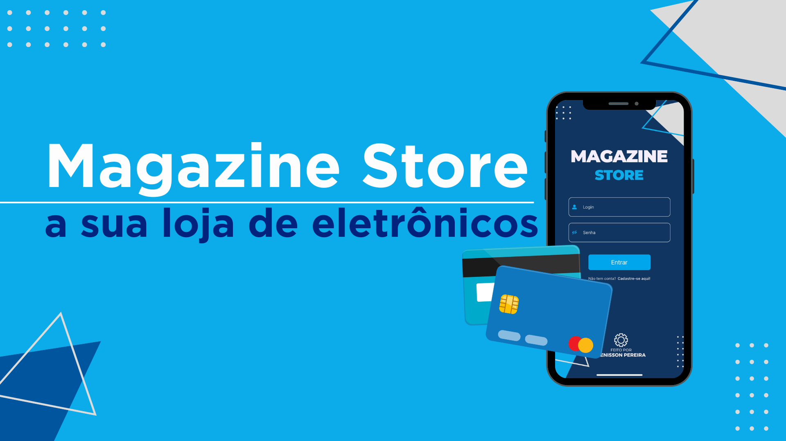
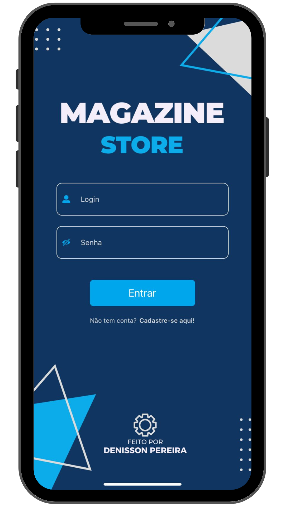
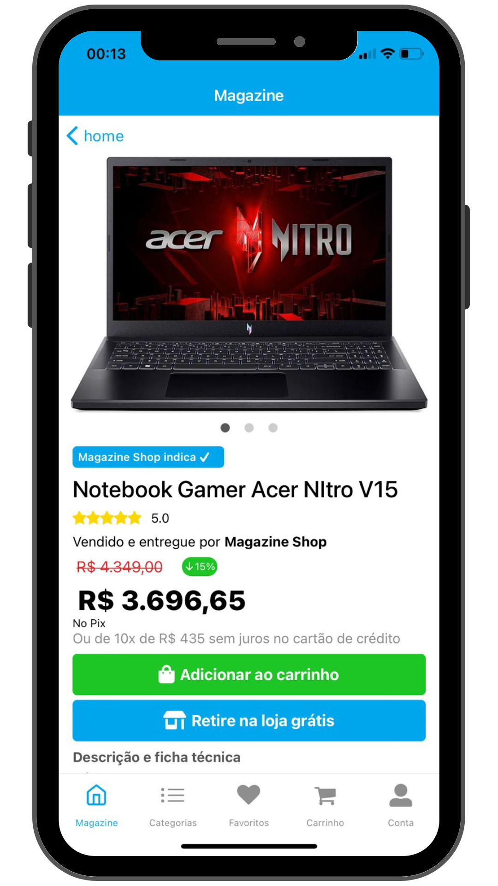
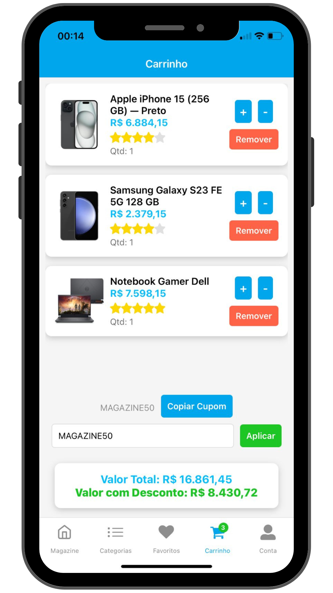
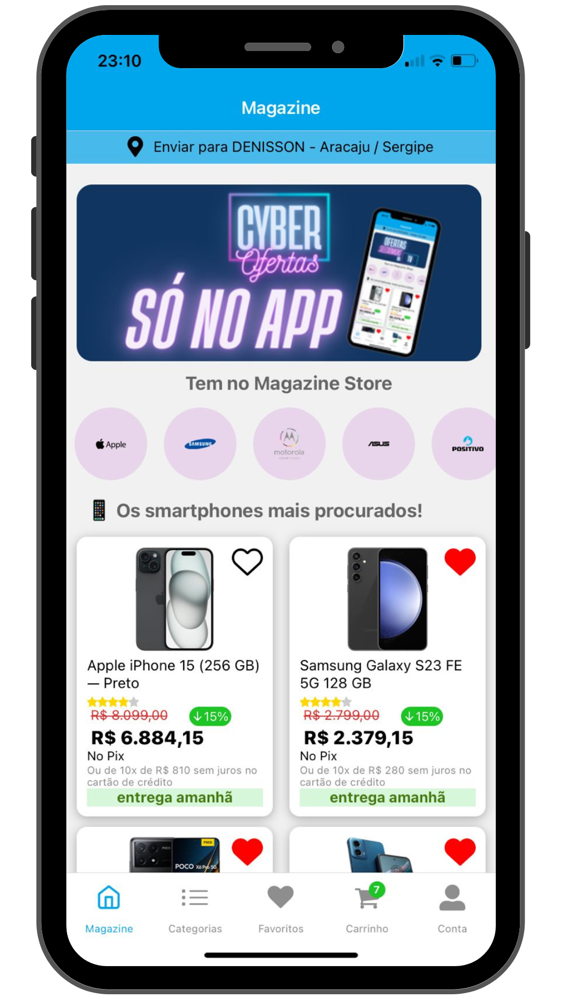
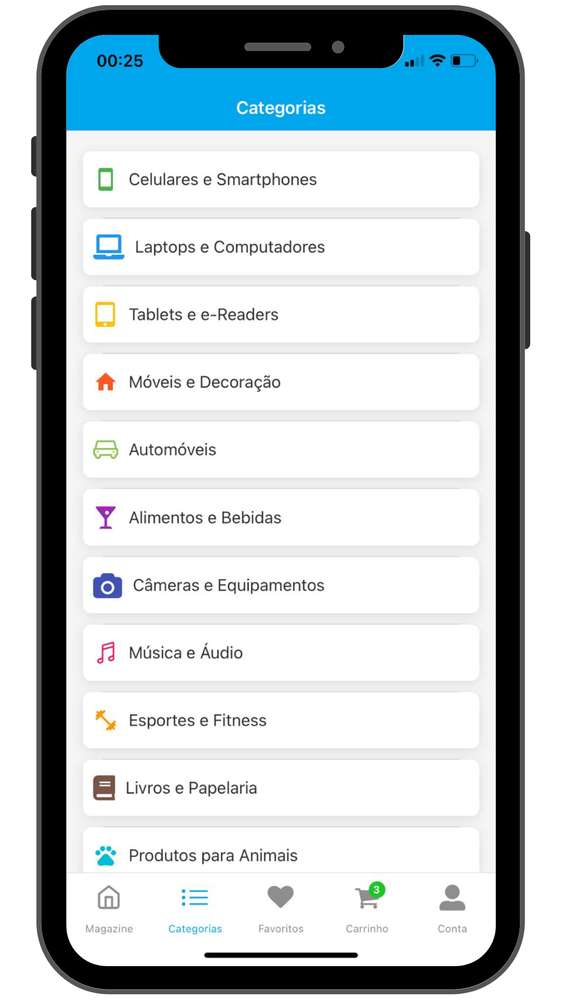

 

<p align="center">
  <a href="https://github.com/Denisson-Pereira/magazine-store"></a>
  <a href="https://github.com/Denisson-Pereira/magazine-store/issues"></a>
  <a href="https://github.com/Denisson-Pereira/magazine-store/graphs/contributors"></a>
  <a href="https://github.com/Denisson-Pereira/magazine-store/commits/main"></a>
  <a href="https://github.com/Denisson-Pereira/magazine-store/stargazers"></a>
</p>


# 📑 Sobre o projeto 


O projeto **Magazine Store** é uma plataforma completa que integra **backend** e **frontend** para oferecer uma experiência de compra de eletrônicos de alta qualidade. Desenvolvido com **Java** e **Spring Boot**, o backend é robusto e eficiente, garantindo uma gestão eficaz dos dados e operações da loja. O banco de dados, projetado e implementado em **MySQL** pelo próprio autor, oferece uma base sólida e confiável para armazenar e manipular as informações de produtos, usuários e transações.

O **frontend**, construído com **React Native**, proporciona uma interface amigável e intuitiva para os usuários. O aplicativo inclui funcionalidades essenciais, como um carrinho de compras dinâmico, um sistema de favorecimento de produtos, e uma classificação detalhada das categorias de produtos. Além disso, o sistema de cupons de desconto e a opção de aplicar descontos por produto tornam a experiência de compra ainda mais atraente. A criação de contas e a autenticação são gerenciadas com **JWT**, assegurando a segurança e a personalização da experiência do usuário.

## 📚 Stack Tecnológica


### • Design


### • Backend

[](https://www.java.com/)

[](https://spring.io/)


### • Mobile


# ⚙ Pré-requisitos

## Certifique-se de ter o Node.js instalado

Antes de mais nada, verifique se você tem o Node.js instalado em sua máquina. Você pode baixá-lo e instalá-lo a partir do site oficial do Node.js:

[](https://nodejs.org/en) 

## Instale o Expo CLI globalmente

Abra o terminal ou prompt de comando e execute o seguinte comando para instalar o Expo CLI globalmente em sua máquina:

```
npm install -g expo-cli
```

# 🚀 Como executar o projeto 🚀

## ⬇️ Clonar repositório git

```
git clone https://github.com/Denisson-Pereira/magazine-store
```

## 🏧 Backend

Após clonar o repositório, para acessar o backend, basta digitar o seguinte comando no terminal:

```
cd backend
```

Lembre-se de que os dados estão localizados, a partir da raiz do projeto, em database/Dump20240807.sql


## 📱 Mobile

Para acessar a pasta do projeto, digite no terminal o seguinte comando:

```
cd mobile
```

Após entrar na pasta, instale as dependências do projeto com o seguinte comando:

```
npm install 
```

Tudo pronto! para visualizar o projeto, digite:

```
npx expo start
```


# 📸 Visuals and Screenshots

Dê uma espiada no nosso projeto em funcionamento e esclareça todas as suas dúvidas sobre como executá-lo!

## 📱 Responsividade e Mobile

<div style="display: flex; gap: 10px;">
    
    
    
    
    
    
</div>

## 🎥 Tutorial em Vídeo

<div align="center">
    <video width="560" height="315" controls>
        <source src="./github/video.mp4" type="video/mp4">
        Seu navegador não suporta a tag de vídeo.
    </video>
</div>


## 📺 Editor de código

Neste projeto, foi utilizado o Visual Studio Code como editor de código.

[](https://code.visualstudio.com/)


# 🚨 Aguarde! Ainda não terminou!

>Este projeto está atualmente em desenvolvimento, e está sujeito a futuras atualizações e melhorias conforme evolui. Estamos trabalhando para torná-lo ainda mais robusto e funcional ao longo do tempo. Agradecemos sua paciência e interesse nesta fase inicial.

>Além disso, gostaríamos de ressaltar que este projeto é aberto a contribuições de qualquer pessoa interessada em colaborar. Se você tem ideias, sugestões ou melhorias para oferecer, sinta-se à vontade para participar do desenvolvimento do projeto. Juntos, podemos criar algo incrível e beneficiar a comunidade de forma colaborativa.

## 📜 Licença

[](https://github.com/Denisson-Pereira/magazine-store/blob/main/LICENSE) 

## ✏️ Autor 

Denisson Pereira Santos

<div align='center'> 
<a href="https://www.linkedin.com/in/denisson-pereira" target="_blank"></a> 
<a href="https://denissonpereira.com" target="_blank"></a> 
<a href="https://github.com/DenissonPereira" target="_blank"></a> 
<a href="https://www.instagram.com/denisson_pereira1?igshid=OGQ5ZDc2ODk2ZA%3D%3D&utm_source=qr" target="_blank"></a>
</div>&nbsp;&nbsp;